# V09 - enrichissement des fonctionnalités + composants visuels

Dans cette version, nous allons ajouter les fonctionnalités / caractéristiques suivantes :

* Du côté serveur :
  * L'ajout d'un **champ "date de naissance"** pour les membres.
  * La gestion d'un **rôle "administrateur"** pour les membres. Les membres qui ne sont pas administrateurs ont un accès restreint à l'API REST : ils peuvent simplement demander le nombre de membres présents dans le système. Par contre, les membres administrateurs ont un accès complet aux données des membres et peuvent appeler toutes les opérations CRUDL offertes par l'API.
* Du côté client :
  * Un membre non-administrateur n'a accès qu'à sa page d'accueil dans laquelle on affiche le nombre de membres dans le système.
  * Un membre administrateur a accès à une page qui lui permet de gérer la liste des membres et d'y effectuer les opérations CRUDL.

Voici quelques copies d'écrans qui illustrent ces fonctionnalités :

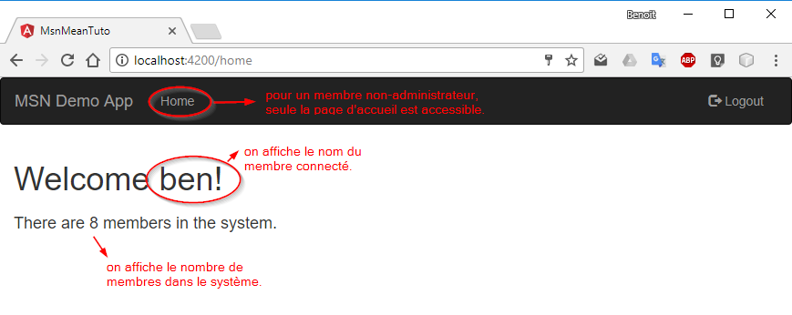

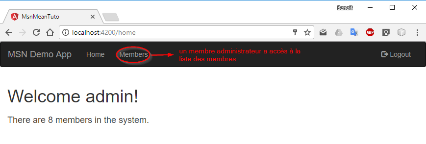

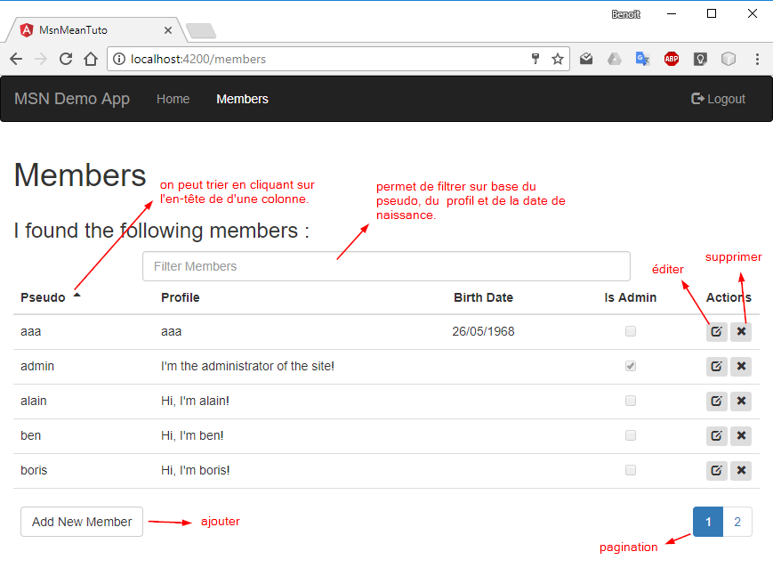

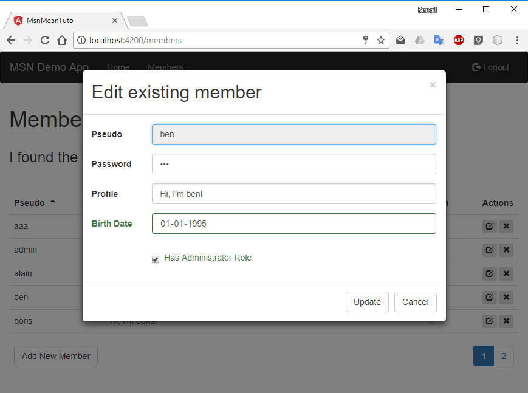


## Côté serveur

#### server/models/member.ts

On a ajouté dans le modèle un champ `birthdate` et un champ `admin` :

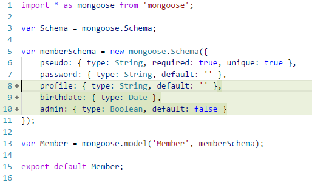

#### server\server.ts

Dans le code d'initialisation de la base de données, on vérifie s'il y a un membre `admin`, et si ce n'est pas le cas, on l'y ajoute, histoire d'avoir au moins un administrateur dans le système :

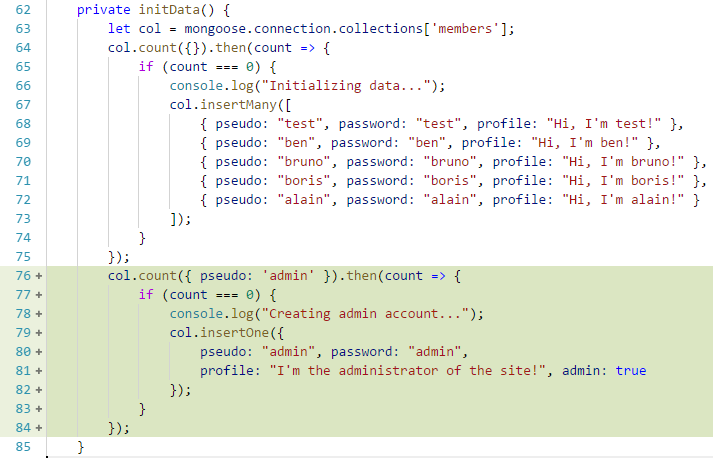

#### server\routes\authentication.router.ts

On stocke le flag `admin` dans le token, afin de permettre au serveur et au client de ne pas devoir revérifier en base de données si l'utilisateur connecté est un administrateur ou pas :

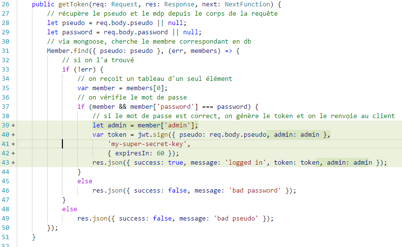

On ajoute une méthode "filtre" `checkAdmin()` qui permet de vérifier dans la version décodée du token si le flag `admin` est positionné à `true`. Si ce n'est pas le cas, on renvoie une réponse HTTP avec un status 403 en indiquant un problème de droit d'accès :

#### 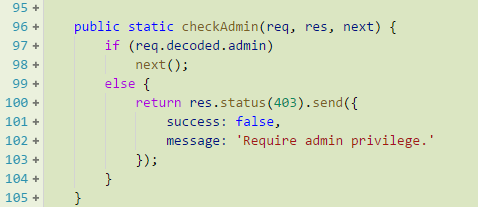

#### server\routes\members.router.ts

On a ajouté :

*   La route `/count` dans l'API, ainsi que la méthode `getCount()` correspondante.
*   Le filtre `checkAdmin()`, juste après la route `/count` et avant les autres routes. Selon le principe de fonctionnement des filtres de Express, cela permet de faire en sorte que les routes qui suivent le filtre ne soient accessibles que si le filtre répond positivement. Dans ce cas-ci, cela permet de ne rendre accessible le reste de l'API qu'aux membres qui sont des administrateurs.
*   Aux lignes 43-44, lors de la création d'un nouveau membre, on supprime la valeur du champ `_id` du corps de la requête HTTP. Ceci est rendu nécessaire par le fait que nous allons utiliser un formulaire pour encoder les données des nouveaux membres et que ce formulaire sera *bindé* sur un objet `Member` (classe du côté client) qui possède un attribut `_id`. Du coup, comme cet attribut existe dans l'objet, mongoose va essayer de l'utiliser pour créer le nouveau membre, alors qu'on souhaite que mongoose lui attribue une nouvelle valeur automatiquement (un nouvel ObjectId).

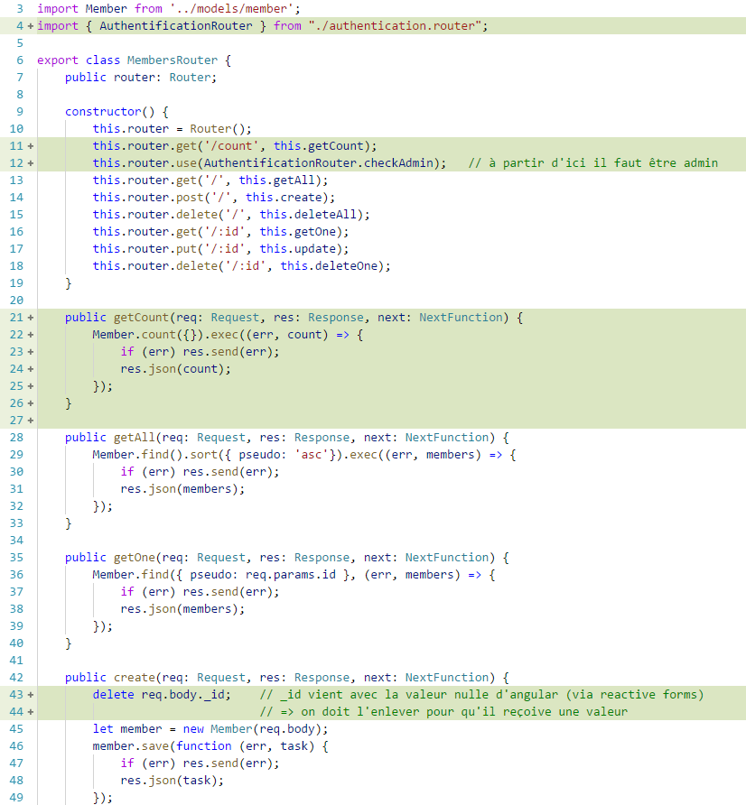


## Côté client

#### src\app\securedhttp.service.ts

On modifie les méthodes `login()` et `logout()` pour que, respectivement, elles stockent et effacent le flag `admin` dans le `sessionStorage` du navigateur :

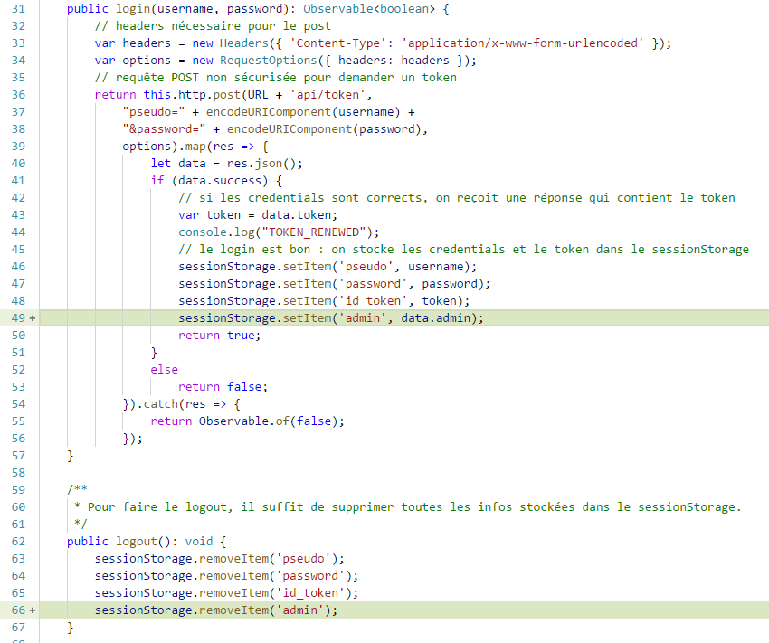

#### src/app/auth.service.ts

On ajoute une méthode qui vérifie dans le `sessionStorage` si l'utilisateur connecté est un administrateur :

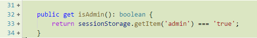

#### src\app\auth-guard.service.ts

On ajoute une nouvelle classe `AdminGuard` dont le rôle va être de bloquer la navigation quand l'URL demandée est réservée aux administrateurs et que le membre connecté n'est pas administrateur. Dans ce cas-là, on le redirige vers l'URL `/restricted`  :

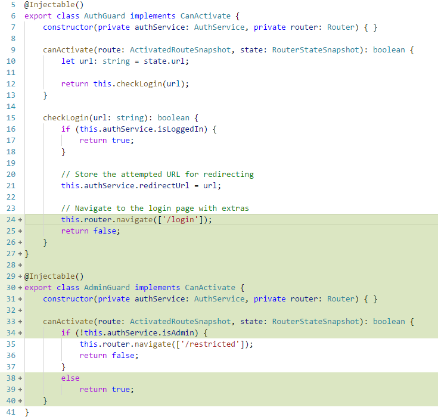

#### src\app\app.module.ts

On voit ci-dessous comment `AdminGuard` est utilisée pour restreindre l'accès à la page `/members` :

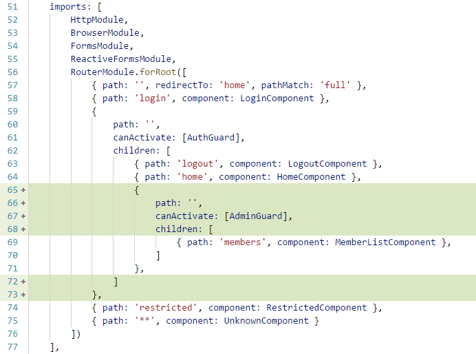

Les autres modifications dans ce fichier sont simplement des déclarations des nouveaux composants et services de cette version.

#### src\app\app.component.html

On rend l'affichage de l'entrée de menu `Members` dépendant du fait que l'utilisateur connecté est un administrateur ou non :

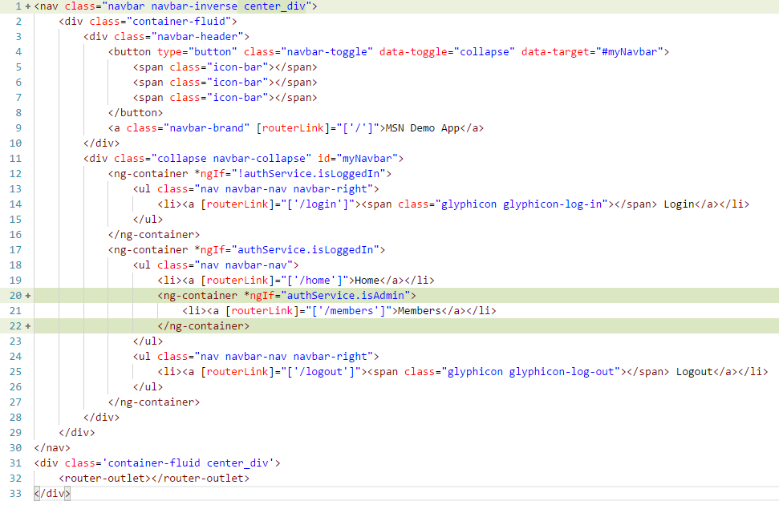

Autre petit changement : on a ajouté dans `styles.css` une règle de style `center_div` pour limiter la largeur de l'affichage des pages et les centrer dans le navigateur :

```css
.center_div {
    width: 100%;
    max-width: 1024px;
    margin: 0 auto;
}
```

#### src\app\member.service.ts

D'une part on a modifié la classe `Member` pour qu'elle prenne en compte les deux nouvelles données : la date de naissance et le flag administrateur. On observe que la date de naissance est stockée dans un attribut de type `string` et pas `Date`. La raison en est que les instances de `Member` vont être bindées avec des champs dans des formulaires et que le format qu'il faut utiliser pour les champs `<input type="date">` est le format ISO `YYYY-MM-DD`. C'est pour cela que, dans le constructeur, si la date reçue en JSON dans `data.birthdate` a une longueur supérieure à 10 caractères, on ne conserve que les 10 premiers caractères.

D'autre part, dans la classe `MemberService`, on ajoute la méthode `getCount()` qui interface la route correspondante dans l'API REST.

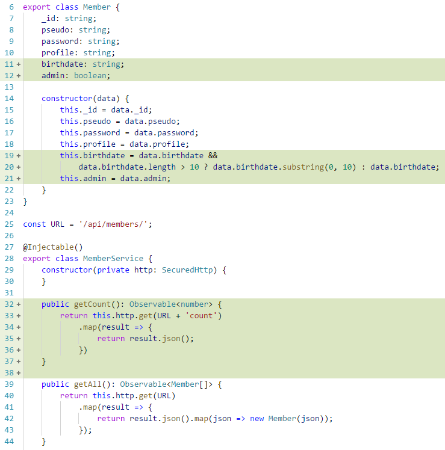

#### src\app\home.component.*

Dans ce composant :

*   On affiche le nom de l'utilisateur connecté, donné par `authService.currentUser`.
*   On affiche simplement le nombre de membres enregistrés dans la base de données en faisant appel à `MemberService.getCount()` :

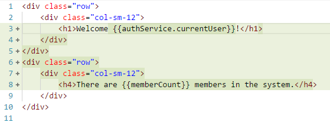

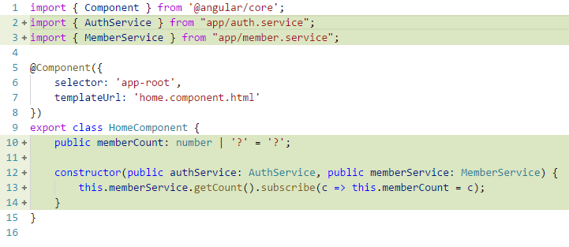

#### src\app\login.component.html

Dans le composant de login, on a remplacé les blocs de code HTML qui correspondaient aux champs du formulaire accompagnés des balises `div` et des classes spécifiques à Bootstrap par l'utilisation d'un composant "maison" : `<my-input>` :

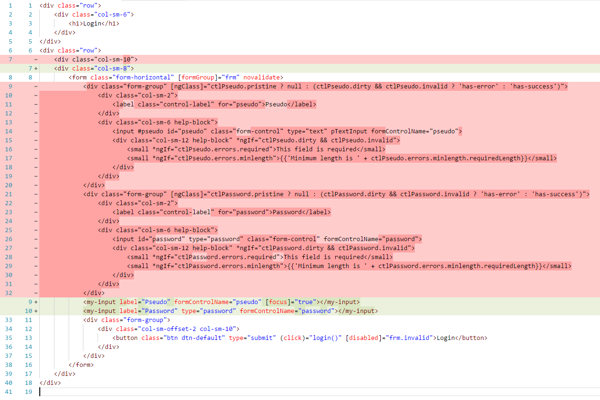

En gros, les occurrences de code du type :

```html
<div class="form-group" [ngClass]="ctlPseudo.pristine ? null : (ctlPseudo.dirty && ctlPseudo.invalid ? 'has-error' : 'has-success')">
    <div class="col-sm-2">
        <label class="control-label" for="pseudo">Pseudo</label>
    </div>
    <div class="col-sm-6 help-block">
        <input #pseudo id="pseudo" class="form-control" type="text" pTextInput formControlName="pseudo">
        <div class="col-sm-12 help-block" *ngIf="ctlPseudo.dirty && ctlPseudo.invalid">
            <small *ngIf="ctlPseudo.errors.required">This field is required</small>
            <small *ngIf="ctlPseudo.errors.minlength">{{'Minimum length is ' + ctlPseudo.errors.minlength.requiredLength}}</small>
        </div>
    </div>
</div>
```

sont entièrement remplacées par une seule ligne de code :

```html
<my-input label="Pseudo" formControlName="pseudo" focus="true"></my-input>
```

Le composant `<my-input>` gère donc :
* le champ d'input en lui-même
* le label associé et le fait qu'un click sur le label met le focus dans le champ
* la gestion de la couleur de la bordure et du label en fonction du fait qu'il y a ou non une erreur
* l'affichage des erreurs

Les attributs qu'il faut définir pour utiliser ce composant sont :
* `label` : le label à afficher à gauche du champ
* `type` : le type de champ input (même rôle que l'attribut `type` dans le composant `<input>` de HTML). Par défaut, il s'agit du type `'text' `
* `formControlName` : le nom du `FormControl` avec lequel doit être bindé le composant
* `focus` : indique si le champ doit avoir le focus au moment de l'affichage du formulaire

Le composant `<my-input>` est implémenté dans le fichier `myinput.component.ts`, lui-même héritant du composant `mycontrol.component.ts`. Le fonctionnement interne de ces deux classes n'est pas détaillé ici, mais si cela vous intéresse, n'hésitez pas à analyser son code et à poser des questions à votre professeur.

#### src\app\login.component.ts

Le code de ce composant n'a quasiment pas changé. La seule chose qu'on y a fait, c'est d'enlever la gestion du focus sur le champ pseudo, puisque celle-ci est maintenant prise en compte par le composant `<my-input>`.

#### src\app\validation.service.ts

La classe `ValidationService` est un service qui permet de récupérer la libellé des messages d'erreurs provoqués par les validateurs grâce à la méthode `getValidatorErrorMessage()`. Ce service est utilisée par le composant `<my-input>` :

```typescript
import { Injectable } from "@angular/core";

@Injectable()
export class ValidationService {
    public getValidatorErrorMessage(validatorName: string, validatorValue?: any) {
        let config = {
            required: 'This field is required',
            minlength: `Minimum length is ${validatorValue.requiredLength}`,
            maxlength: `Maximum length is ${validatorValue.requiredLength}`,
            forbiddenValue: 'This value is forbidden',
            pseudoUsed: 'This pseudo is not available',
        };
        return config.hasOwnProperty(validatorName) ? config[validatorName] : '[' + validatorName + ']';
    }
}
```

#### src\app\memberlist.component.*

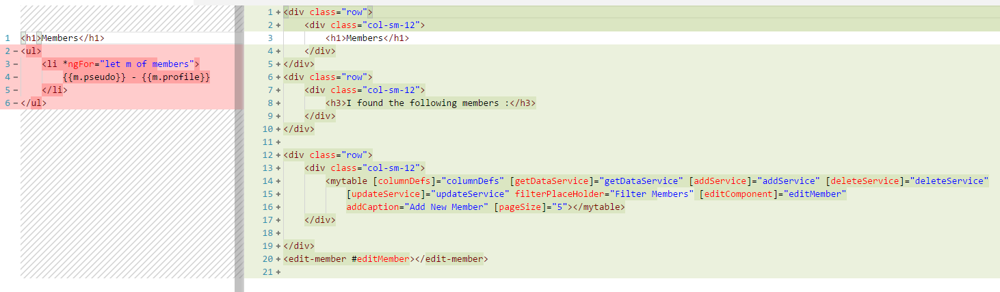

L'affichage de la liste des membres a été remplacé par l'utilisation d'un composant "maison" `<mytable>`. Ce composant s'utilise en définissant les attributs suivants :

* `columDefs` : fournit au composant un tableau d'objets `ColumnDef` dont chaque élément contient la définition d'une colonne de la table à afficher.
* `getDataService` : fournit au composant le nom d'une fonction qui sera appelée quand le composant aura besoin de lire les données à afficher.
* `addService` : fournit au composant le nom d'une fonction qui sera appelée quand le composant aura besoin d'ajouter une nouvelle entrée dans la liste.
* `deleteService` : fournit au composant le nom d'une fonction qui sera appelée quand le composant aura besoin de supprimer une entrée dans la liste.
* `updateService` : fournit au composant le nom d'une fonction qui sera appelée quand le composant aura besoin de modifier les données d'une entrée dans la liste.
* `filterPlaceHolder` : le texte à afficher sous la forme d'un _place holder_ dans la zone de filtre quand celle-ci est vide.
* `addCaption` : le texte à afficher dans le bouton qui permet d'ajouter un nouvel élément.
* `pageSize` : le nombre de lignes à afficher dans chaque page.
* `editComponent` : le label du composant à afficher en popup lorsqu'on demande l'édition d'un élément de la liste. Ce label doit être associé à un élément HTML, par exemple ici `<edit-member #editMember>`

Les définitions des colonnes `ColumnDef` répondent à la classe suivante (voir `mytable.component.ts`) :

```typescript
interface ColumnDef {
    // nom du champ/attribut associé à la colonne
    name: string,
    // type de donnée pour les valeurs affichées dans cette colonne (ex: String, Date, Bool)
    type: string,
    // en-tête de la colonne
    header: string,
    // largeur de la colonne (les largeurs sont gérées de manière proportionnelles sur l'ensemble des colonnes)
    width?: number,
    // indique si la colonne contient la donnée "clé" (identifiante) d'un record affiché
    key?: boolean,
    // indique si la colonne doit être prise en compte dans le filtrage des données 
    filter?: boolean,
    // indique si la colonne le tri initial de la table doit être fait sur base de cette colonne
    sort?: SortDirection,
    // indique comment le texte doit être aligné horizontalement à l'affichage dans cette colonne
    align?: 'left' | 'right' | 'center' | 'justify' | ''
}
```

Voici le code typescript du composant `memberlist` :

```typescript
import { Component, ViewChild } from "@angular/core";
import { MemberService, Member } from "app/member.service";
import { EditMemberComponent } from "app/edit-member.component";
import { ColumnDef } from "app/mytable.component";
import { SnackBarComponent } from "app/snackbar.component";

@Component({
    selector: 'memberlist',
    templateUrl: './memberlist.component.html',
})
export class MemberListComponent {
    columnDefs: ColumnDef[] = [
        { name: 'pseudo', type: 'String', header: 'Pseudo', width: 1, key: true, filter: true, sort: 'asc' },
        { name: 'profile', type: 'String', header: 'Profile', width: 2, filter: true },
        { name: 'birthdate', type: 'Date', header: 'Birth Date', width: 1, filter: true, align: 'center' },
        { name: 'admin', type: 'Boolean', header: 'Is Admin', width: 1, filter: false, align: 'center' }
    ];

    constructor(private memberService: MemberService) {
    }

    get getDataService() {
        return m => this.memberService.getAll();
    }

    get addService() {
        return m => this.memberService.add(m);
    }

    get deleteService() {
        return m => this.memberService.delete(m);
    }

    get updateService() {
        return m => this.memberService.update(m);
    }
}
```

Le composant `<mytable>` est implémenté dans les fichiers `mytable.component.*`. Il utilise en interne la classe `MyDataSource` définie dans `mydatasource.ts`, cette dernière étant la classe qui gère la liste des données telles qu'affichées. Le fonctionnement interne de ces classes n'est pas totalement détaillé ici, mais si cela vous intéresse, n'hésitez pas à analyser son code et à poser des questions à votre professeur.

#### Utilisation du composant `<edit-member>` ####

La dernière ligne du composant `memberlist.component.html` est une balise `<edit-member>` : 

`<edit-member #editMember></edit-member>`

Le hashtag `#editMember` permet de référencer ce composant dans le code du composant `memberlist.component.html`. 

Un des attributs de `mytable` fait référence à ce composant : `[editComponent]="editMember"`. 

C'est ce composant qui sera utilisé lors de la demande d'édition d'une ligne de la table. 

##### Description de la méthode `edit` de `mytable.component.ts` : ##### 

- appelle la méthode `show`  du composant `edit-member` et 

- reçoit en retour un *Observable*  qui 

- lui permettra  d'effectuer le travail de mise à jour ou d'ajout en fonction de la valeur de l'*Observable*. 

  ​

#### src\app\edit-member.component.ts ####

##### Interface IDialog ##### 

Le composant `edit-member` implémente une interface maison : `IDialog`. 

```typescript
import { EventEmitter } from "@angular/core";
import { Subject } from "rxjs/Subject";

export interface DialogResult {
    action: 'update' | 'cancel',
    data: object
}

export interface IDialog {
    show(obj: any): Subject<DialogResult>
}
```

Celle-ci expose la méthode `show` qui retourne un `Subject<DialogResult>` , une sorte d'*Observable* contenant, ici, un `DialogResult` (interface contenant l'action effectuée et les données modifiées).

##### Code de `edit-member.component.ts` : #####

```typescript
import { Component, OnInit, Inject, ElementRef, ViewChild, Output, EventEmitter, TemplateRef } from '@angular/core';
import { FormGroup, FormBuilder, Validators, FormControl } from "@angular/forms";
import { MemberService, Member } from "app/member.service";
import { IDialog, DialogResult } from "app/dialog";
import { Observable } from "rxjs/Observable";
import { Subject } from "rxjs/Subject";
import { MyInputComponent } from "app/myinput.component";
import { MyModalComponent } from "app/mymodal.component";
import { validateConfig } from '@angular/router/src/config';

declare var $: any;

@Component({
    selector: 'edit-member',
    templateUrl: 'edit-member.component.html'
})
export class EditMemberComponent implements OnInit, IDialog {
    public frm: FormGroup;
    public ctlPseudo: FormControl;
    public ctlProfile: FormControl;
    public ctlPassword: FormControl;
    public ctlBirthDate: FormControl;
    public ctlAdmin: FormControl;
    public closed: Subject<DialogResult>;

    @ViewChild(MyModalComponent) modal: MyModalComponent;
    @ViewChild('pseudo') pseudo: MyInputComponent;

    constructor(private memberService: MemberService, private fb: FormBuilder) {
        this.ctlPseudo = this.fb.control('', [Validators.required, Validators.minLength(3),             								this.forbiddenValue('abc')], [this.pseudoUsed()]);
        this.ctlPassword = this.fb.control('', [Validators.required, Validators.minLength(3)]);
        this.ctlProfile = this.fb.control('', []);
        this.ctlBirthDate = this.fb.control('', []);
        this.ctlAdmin = this.fb.control(false, []);
        this.frm = this.fb.group({
            _id: null,
            pseudo: this.ctlPseudo,
            password: this.ctlPassword,
            profile: this.ctlProfile,
            birthdate: this.ctlBirthDate,
            admin: this.ctlAdmin
        }, { validator: this.crossValidations });
    }

    // Validateur bidon qui vérifie que la valeur est différente
    forbiddenValue(val: string): any {
        return (ctl: FormControl) => {
            if (ctl.value === val)
                return { forbiddenValue: { currentValue: ctl.value, forbiddenValue: val } }
            return null;
        };
    }

    // Validateur asynchrone qui vérifie si le pseudo n'est pas déjà utilisé par un autre membre
    pseudoUsed(): any {
        let timeout;
        return (ctl: FormControl) => {
            clearTimeout(timeout);
            let pseudo = ctl.value;
            return new Promise(resolve => {
                timeout = setTimeout(() => {
                    if (ctl.pristine)
                        resolve(null);
                    else
                        this.memberService.getOne(pseudo).subscribe(member => {
                            resolve(member ? { pseudoUsed: true } : null);
                        });
                }, 300);
            });
        };
    }

    static assert(group: FormGroup, ctlName: string[], value: boolean, error: object) {
        ctlName.forEach(n => {
            if (group.contains(n)) {
                if (!value) {
                    group.get(n).setErrors(error);
                    group.get(n).markAsDirty();
                }
                else {
                    group.get(n).setErrors(null);
                }
            }
        });
    }

    crossValidations(group: FormGroup) {
        if (group.pristine || !group.value) return;
        EditMemberComponent.assert(
            group,
            ['password', 'profile'],
            group.value.password != group.value.profile,
            { passwordEqualProfile: true }
        );
    }

    ngOnInit() {
        this.modal.shown.subscribe(_ => this.pseudo.setFocus(true));
    }

    show(m: Member): Subject<DialogResult> {
        this.closed = new Subject<DialogResult>();
        this.frm.reset();
        this.frm.markAsPristine();
        this.frm.patchValue(m);
        this.modal.show();
        return this.closed;
    }

    update() {
        this.modal.close();
        this.closed.next({ action: 'update', data: this.frm.value });
    }

    cancel() {
        this.modal.close();
        this.closed.next({ action: 'cancel', data: this.frm.value });
    }

    ouvrir() {
        console.log("ouvert");
    }

    fermer() {
        console.log("fermé");
    }
}
```

Au sein de cette classe, on déclare différents attributs de type `FormControl` qui est une classe de Angular encapsulant *grosso modo* une balise html `<input>` (mais peut encapsuler d'autres éléments également). L'utilisation qui en est faite ici permet d'associer des validations via la classe `Validator` de Angular. 

Dans le constructeur de cette classe, on trouve la ligne suivante : 

```typescript
this.ctlPseudo = this.fb.control('', [Validators.required, Validators.minLength(3), 			    								  this.forbiddenValue('abc')], [this.pseudoUsed()]);
```

 Le *FormControl* est construit via un objet `FormBuilder` de Angular (méthode `control` ). Cette méthode  peut recevoir jusqu'à trois paramètres :

- Le premier est la valeur initiale du contrôle.
- Le deuxième est un tableau de validateurs appelés de manière synchrone : certains sont prédéfinis dans la classe `Validator`, mais on peut également définir ses propres validateurs (voir par exemple la méthode `forbiddenValue`).
- Le troisième est un tableau de validateurs appelés de manières asynchrone, ici comprenant uniquement la méthode `pseudoUsed`. Cette méthode fait un appel asynchrone au serveur pour vérifier si le pseudo n'est pas déjà utilisé. 
  <u>Remarque</u> : on diffère la requête de 300 ms pour permettre à l'utilisateur de taper plusieurs caractères dans le contrôle `pseudo` avant d'envoyer la requête au serveur. Cela permet de minimiser le nombre de requêtes effectuées vers le serveur. 

Dans le constructeur, on voit également que l'on regroupe tous les contrôles en un groupe (de type `FormGroup`). Cela permet de configurer des validations croisées (portant sur plusieurs champs).

##### @ViewChild #####

Dans la classe, on trouve deux attributs marqués avec l'annotation `@ViewChild` : `modal` et `pseudo` . Cette annotation Angular permet de manipuler un élément d'un composant enfant à partir du composant parent.  l'attribut `modal`fait référence au composant `MyModalComposant` (voir ci-dessous) et l'attribut `pseudo` à un composant `<myinput>` *taggé* avec la valeur *pseudo* (voir code html du composant), afin de lui donner le *focus* lorsque le composant est affiché.


####src\app\edit-member.component.html

```html
 <mymodal title="{{(frm.value._id ? 'Edit existing' : 'Add a new') + ' member'}}" 
    (shown)="ouvrir()"     
    (closed)="fermer()">
    <div body>
        <div class="row">
            <div class="col-sm-12">
                <form id="frm" class="form-horizontal" [formGroup]="frm" novalidate>
                    <my-input #pseudo label="Pseudo" 
                              formControlName="pseudo" [readonly]="frm.value._id"></my-input>
                    <my-input label="Password" type="password" 
                              formControlName="password"></my-input>
                    <my-input label="Profile" formControlName="profile"></my-input>
                    <my-input label="Birth Date" type="date" 
                              formControlName="birthdate"></my-input>
                    <my-input label="Has Administrator Role" 
                              type="checkbox" formControlName="admin"></my-input>
                </form>
            </div>
        </div>
    </div>
    <div footer>
        <button type="submit" form="frm" class="btn btn-default" 
                [disabled]="frm.pristine || frm.invalid || frm.pending"
            (click)="update()">{{frm.value._id ? 'Update' : 'Add'}}</button>
        <button type="reset" class="btn btn-default" (click)="cancel()">Cancel</button>
    </div>
</mymodal>

```

Dans le template associé au composant, on trouve une référence à un composant enfant `<mymodal>` (voir ci-dessous).  Cette balise a plusieurs attributs :

- `title` : fournira le titre à la balise enfant
- `(shown)` et `(closed)` : les parenthèses indiquent qu'il s'agit d'événements déclenchés par le composant enfant. On indique le code qui devra être exécuté lorsque ces événements se produiront.

A l'intérieur de cette balise, on fournit du code html qui permet de paramétrer ce composant enfant (les  `<div>` *body* et *footer* seront intégrées au composant `<mymodal>` ) . On dit que le composant parent **projette** des éléments vers le composant enfant.

La `<div body>` contient tous les composants `<my-input>` correspondant aux attributs *FormControl* du composant. On remarque le *hashtag #pseudo*  correspondant au composant associé au pseudo.

La `<div footer>` contient les boutons du composant.

#### src\app\mymodal.component.ts 

##### Le selector et le template

```html
@Component({
    selector: 'mymodal',
    template: `
        <div #myModal id="myModal" class="modal fade" role="dialog">
            <div class="modal-dialog">

                <!-- Modal content-->
                <div class="modal-content">
                    <div class="modal-header">
                        <button type="button" class="close" data-dismiss="modal">&times;</button>
                        <h2 class="modal-title">{{title}}</h2>
                    </div>
                    <div class="modal-body">
                        <ng-content select="[body]"></ng-content>
                    </div>
                    <div class="modal-footer">
                        <ng-content select="[footer]"></ng-content>
                    </div>
                </div>
            </div>
        </div>
    `
})

```

Le template de ce composant utilise une classe css de *bootstrap* pour en faire un composant modal. Il est constitué d'une `<div>` *taggée* pour pouvoir être référencée dans le code du composant. 

Au sein de ce template, on trouve :

```html
<div class="modal-body">
     <ng-content select="[body]"></ng-content>
</div>
<div class="modal-footer">
     <ng-content select="[footer]"></ng-content>
</div>
```

C'est la directive  Angular `<ng-content>` qui permet de récupérer le code html provenant du parent (l'attribut `select` permet, quant à lui, de sélectionner le contenu que l'on veut quand il y a plusieurs balises `<ng-content>`). 

##### Code du composant

```typescript
export class MyModalComponent implements OnInit {
    @Input() title: string = '';
    @Output() shown: EventEmitter<any> = new EventEmitter();
    @Output() closed: EventEmitter<any> = new EventEmitter();
    @ViewChild('myModal') modal: ElementRef;
    private modalElement;

    constructor() {
    }

    ngOnInit() {
        this.modalElement = $(this.modal.nativeElement);
        this.modalElement.on('shown.bs.modal', () => { this.shown.emit(this); });
        this.modalElement.on('hidden.bs.modal', () => { this.closed.emit(this); });
    }

    show() {
        this.modalElement.modal({ backdrop: 'static', keyboard: true });
    }

    close() {
        this.modalElement.modal('hide');
    }
}
```

On remarque l'annotation `@Input`pour l'attribut `title`.

Par contre les attributs `shown` et `closed` sont annotés avec `@Output`. Ils sont du type `EventEmitter` , classe qui permet de déclencher un évément (ce sont eux qui seront récupérés par le composant parent `edit-member`).

- Dans la méthode `ngOnInit`, on associe l'élément html (la `<div>`) à un attribut de la classe. On configure également les événements à déclencher lorsque le composant est affiché ou lorsqu'il est caché. 

  <u>Remarque :</u> Ce mécanisme d'événements sortants n'est pas utilisé dans notre composant parent (on s'en sert uniquement pour faire des affichages à la console) mais pourrait bien être utile dans d'autres circonstances. 

- La méthode `show` est appelée par  la méthode `show` de composant parent. Elle appelle du code JavaScript de *bootstrap* pour afficher le composant.

- La méthode `hide` est appelée par les méthodes `cancel` et `update` du composant parent. Elle s'occupe de cacher le composant (*hide*).


#### src\app\snackbar.component.ts

Le composant `snackbar` permet d'afficher un message au bas du composant `mytable` après un ajout ou une mise à jour d'une ligne de la table. Ce message s'affiche pendant une durée déterminée (ici 10 secondes). Nous n'allons pas décrire le fonctionnement interne de ce composant mais la manière de l'utiliser. La méthode principale de ce composant est la méthode `show` qui reçoit un message, la durée pendant laquelle le *snackbar* doit s'afficher et des fonctions à associer au boutons.

##### template html du composant `MyTableComponent`  

La dernière ligne du template contient le code : 

```html
<snackbar #snackbar></snackbar>
```

On remarque que la balise est *taggée* car elle va être utilisée dans le code du composant

##### Utilisation dans le code du composant `MyTableComponent`

- Récupération de la référence au composant :

```typescript
@ViewChild('snackbar') snackbar: SnackBarComponent;
```

- Exemple d'utilisation du composant (ici après un ajout d'un nouveau membre) :

```typescript
public add(obj: object, cancellable = true) {
        this.dataSource.add(obj);
        this.addService(obj).subscribe(member => {
            this.dataSource.update(member);
            if (cancellable) {
                this.snackbar.show(`Member '${obj[this.key]}' successfully added`, 10000, () => {
                    this.delete(obj, false);
                });
            }
        }, err => {
            this.snackbar.alert('ERROR: ' + err);
        });
    }
```

Dans ce code, après avoir demandé à la couche service l'ajout du membre, on utilise le snackbar (via la méthode `show`) pour permettre le undo. Pour ce faire, l'expression lambda que l'on passe consiste à supprimer le membre que l'on vient d'ajouter. Si la couche service déclenche une erreur, on utilise le snackbar pour afficher un message d'erreur.


**N'hésitez pas à corriger, améliorer, enrichir tous ces composants, en fonction de vos besoins !**
